# Mydoom Worm 
**Sample Sha256 : fff0ccf5feaf5d46b295f770ad398b6d572909b00e2b8bcd1b1c286c70cd9151**

**Sample SHA-1 : f91a4d7ac276b8e8b7ae41c22587c89a39ddcea5**

**File Type :  Win32 Exe**

**Size : 24.0 KB**

#  Overview    
Mydoom is a very old computer worm and is considered to be one of the most destructive malwares, it affects the Microsoft Windows operating system, it was first discovered on January 2004. it installs a backdoor on TCP port 3127, and launched a scheduled denial-of-service (DoS) attack against the website of SCO Group on February 1, 2004 .

Mydoom spreads itself through an infected email attachment to a message. Once the infected executable is run, the worm automatically sends an infected email to every user in the infected machine’s address book, as well as copies itself to a user’s Kazaa shared folder in an attempt to spread through additional means.

----

I started analyzing this malware using some basic static analysis tools, starting with DIE to find the type of the file we have and to find out if this file is packed and with which packer.

it seems to be packed using upx, so let's unpack it and continue our analysis . 

Next, let's load this unpacked version of the malware into pestudio. we can see this malware has been detected by 61 antivirus engines, we can see a lot of interesting imports like `RegSetValue`, `RegOpenKey`, which are used to manipulate the registry keys , imports used to do some networking stuff like `socket`,`send`,`connect`,`gethostbyid` and `recv`, and imports to manipulate the file system like `CreateFile`,`WriteFile`, `FindNextFile` and `FindFirstFile`.

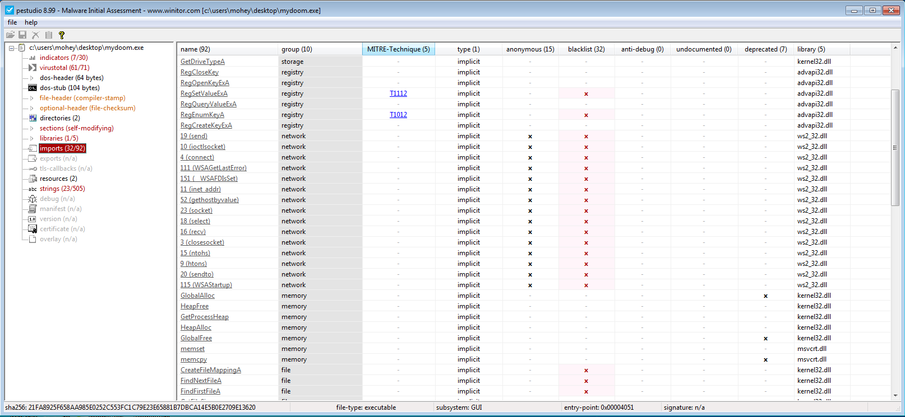

----

Now, let's dig deeper into that malware and start by loading this malware into IDA to see how it really works . 

This malware begins with a call to WSAstartup which initializes the network resources for the winsock dll usage, and then a call to the function `sub_4A3FB1` which does all the interesting stuff.

it begins with a call to `GetTickCount` and a call to the `sub_4A3AA3`. 

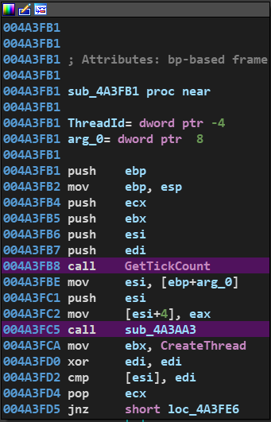

if we take a look at the function `sub_4A3AA3`, it seems to be doing some registry keys modifications, it strarts by decdoing this string `Fbsgjner\Zvpebfbsg\Jvaqbjf\PheeragIrefvba\Rkcybere\PbzQyt32\Irefv`

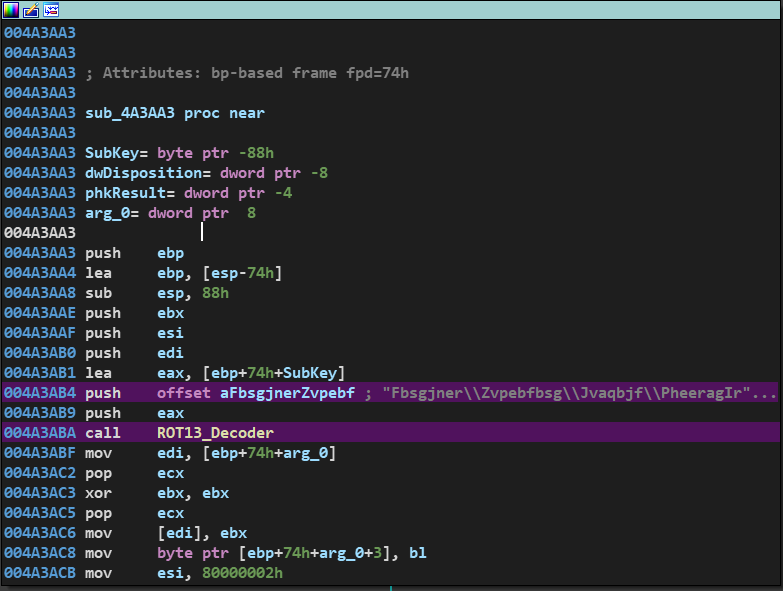

after some digging we found out that function used to decode that string is using  ROT13 algorithm (The ROT13 encdoing is used with almost all strings in this malware so we will see this function gets called a lot ). so if we decrypt it we got this string
`Software\Microsoft\Windows\CurrentVersion\Explorer\ComDlg32\Version` then it uses this string to find if there is a regitsry key with that name if there isn't, it will create one.

----

then it calls `sub_4A3B52` which is reponsible for CreatingMutex to make sure that one instance of the malware is running at a time.

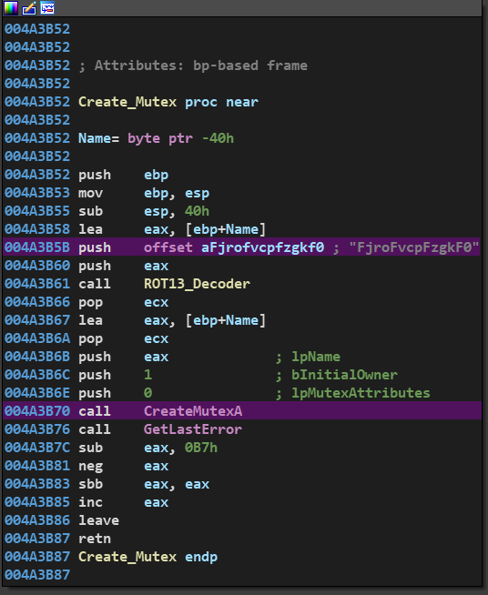

The Mutexname is `FjroFvcpFzgkF0` and as we said before it uses ROT13 encdoing ... So after decoding it the name of the mutex will be `SwebSipcSmtxS0` (Mutex name is a hardcoded-name so we can use it as a good host-based indicator).

----

Then it creates a new thread, Let's take a look at the function where the thread execution begins.

 

this function calls `GetTempPathA`, then it concatenates the result with the strings `\` and `Message`, so the final string will be `%TEMP%\Message` then it creates a file with a call to the `CreateFile` API with the specified name, then it starts writing  random data to that file, then it calls `CreateProcess` to open that file in notepad.

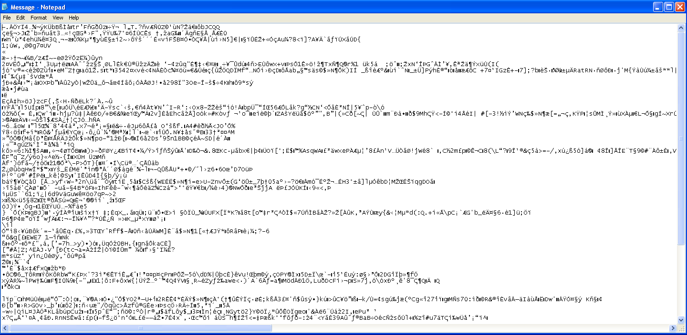

----

After that it calls `sub_4A3962` . 

this fucntion begins by decoding the string `fuvztncv.qyy` with ROT13 algorithm, so it will be `shimgapi.dll`. then it creates a file with that name at the Temp folder or at the system folder `%TEMP%\shimgapi.dll` or `%SYSTEMROOT%\system32\shimgapi.dll` and start copying data to that dll.

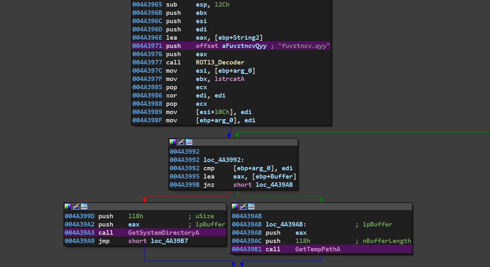

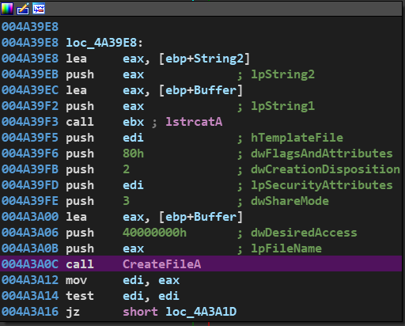

----

Using DIE to find if this dll is packed, we find it is also packed using upx as the original file.

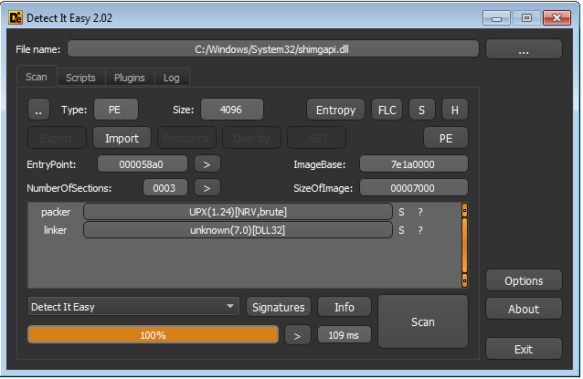

Now, let's unpack it ... analyse this dll to find out what is does.

without digging deep into this dll, it just acts as a backdoor on the infected system, it creates a socket , binding it to listen on  port `3127`  and it just waits for any commands or other files to be sent from the attacker. 

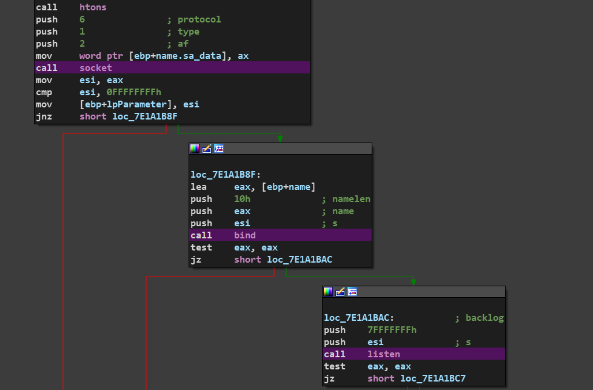

Getting back to our main file. there is a call to `sub_4A3B88`.

it just decodes the string `gnfxzba.rkr` which is `taskmon.exe` and then creates another file with that name at the system folder or the temp folder `%SYSTEMROOT%\system32.taskmon.exe` or `%TEMP%\taskmon.exe` , when analysing this executable we find this exe is nothing but a copy of the original malware. 

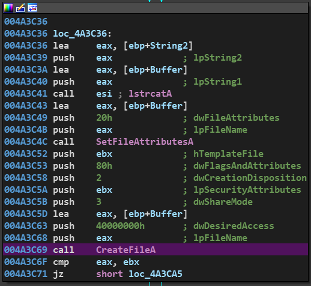

---- 

then it calls `sub_4A3CD7`.

it decodes the 2 strings `Fbsgjner\Zvpebfbsg\Jvaqbjf\PheeragIrefvba\Eha` and `GnfxZba` which will be `Software\Microsoft\Windows\CurrentVersion\Run` and `TaskMon`, then it tries to open that registry key `Software\Microsoft\Windows\CurrentVersion\Run` with `RegOpenKeyExA` API.

then it calls `RegSetValueExA`, we can see what arguments are passed to this function using any debugger by setting a breakpoint before this function gets called.

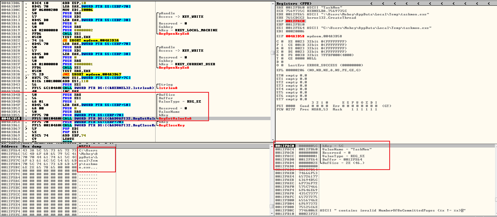

As we can see this function is creating a new entry in that key `Software\Microsoft\Windows\CurrentVersion\Run` (to achieve persistence) with value `TaskMon` and the data stored in that entry is the path of the copied version of the malware which will be `%SYSTEMROOT%\system32.taskmon.exe` or `%TEMP%\taskmon.exe` , so this worm will get executed everytime the system boots up.

----

After that it calls `sub_4A3DB0`

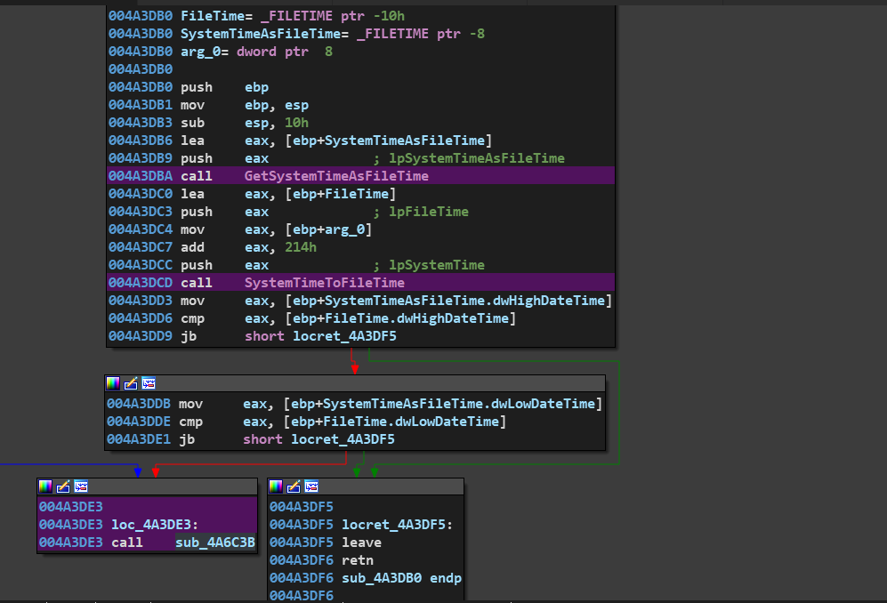

First, it gets the system time, check if it  lies between February 1, 2004 and February 12, 2004. if so, it will call `sub_4A4681`

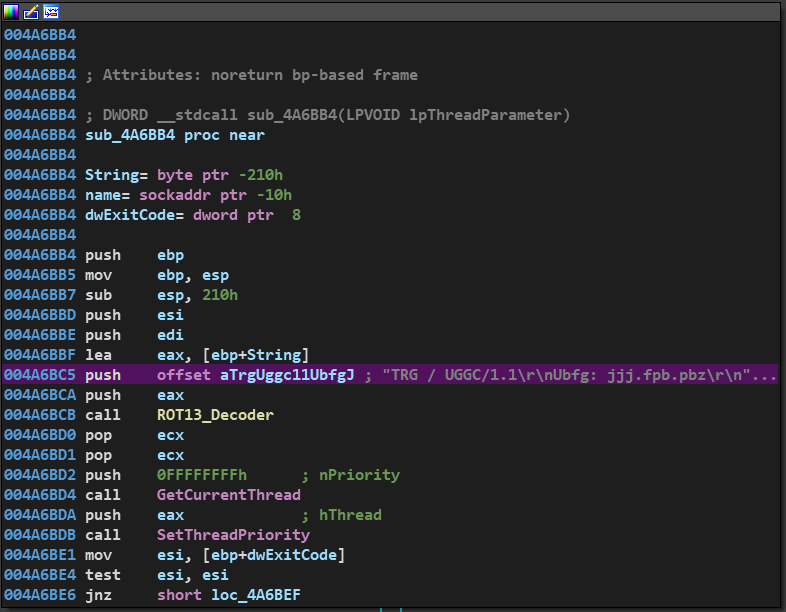

This function is responsible for The Denial Of Service Attack (Dos Attack)  on `www.sco.com`, it starts by decoding the string that forms the http request which is `
GET / HTTP/1.1
Host: www.sco.com
` and start sending these requests until 12th Feb, 2004, it will stop the atttack.

----
It tries to query the data that contains the pathname of the address book from the registry key `Software\Microsoft\WAB\WAB4\Wab File Name`, the address book contains a single list of contacts that can be shared by multiple programs, so the worm can spread by sending an email with a copy of itself to those contacts.

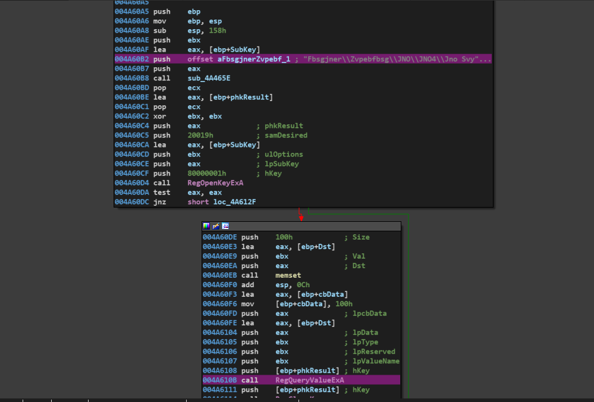

it also starts searching the file system with files with the following extenstions :
- txt
- htmp
- shtl
- phpq
- aspd
- dbxn
- tbbg
- adbh
- wab

which may store emails in them, if any `@` character is found in one of them it will be considered as an email and it will send an email with a copy of mydoom worm to it, also it extracts the domain name of the infected email addresses and concatenates it with a username from the following list.

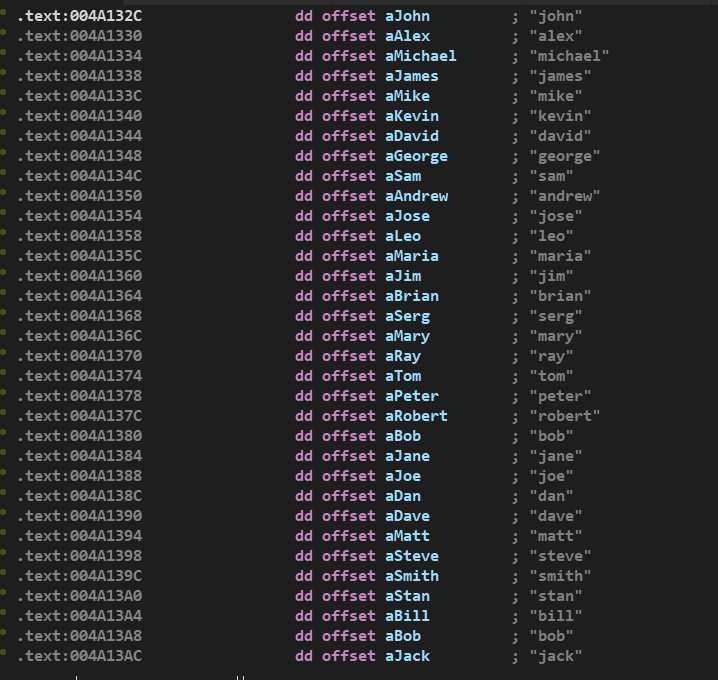

After that is starts forming the email to be sent and attaches a copy of mydoom to the email.
the email subject will be randomly chosen from the following : 
- Error
- Hello
- Server Report
- Mail Transaction Failed
- Mail Delivery System
- hello 
- hi 

They all are ROT13 encoded values. 

the message text will be randomly chosen from the following  : 
- Mail transaction failed. Partial message is available.
- The message contains Unicode characters and has been sent as a binary attachements 
- test
- The message cannot be represented in 7-bit ASCII encoding and has been sent as a binary

the attachement file names will be one the following :
- body
- data
- doc
- document
- file
- message
- readme
- test
- text

and with one of those extensions : 
- bat
- cmd 
- exe 
- pif

it avoids sending itself to the following domain names : 
- acketst
- arin
- avp
- berkeley
- borlan
- example
- fido
- foo.
- fsf.
- gnu
- .gov
- gov.
- hotmail
- iana
- ibm.com
- icrosof
- ietf
- inpris
- isc.o
- isi.e
- kernel
- math
- .mil
- mit.e
- mozilla
- msn.
- mydomai
- nodomai
- panda
- pgp
- rfc-ed
- ripe
- ruslis
- secur
- sendmail
- sopho
- syma
- tanford.e
- usenet
- utgers.ed

It will also avoid sending itself to any user name with the following strings:

- abuse
- anyone
- bugs
- ca
- contact
- feste
- gold-certs
- help
- info
- me
- no
- noone
- nobody
- not
- nothing
- page
- postmaster
- privacy
- rating
- root
- samples
- secur
- service
- site
- spm
- soft
- somebody
- someone
- submit
- the.bat
- webmaster
- you
- your
- www
----

it also copies itself into the kazaa shared folder (Kazaa is a peer-to-peer file sharing application using the fasttrack protocol, used to exchange MP3 music files and other file types, such as videos, applications, and documents) with one of those names :

- winamp5
- icq2004-final
- activation_crack
- strip-girl-2.0bdcom_patches
- rootkitXP
- office_crack
- nuke2004

and with one of those extensions :
- .exe 
- .src
- .pif
- .bat

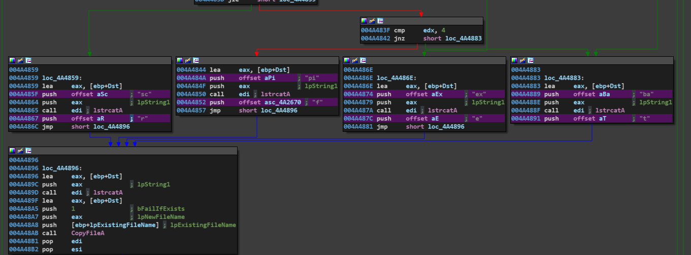

